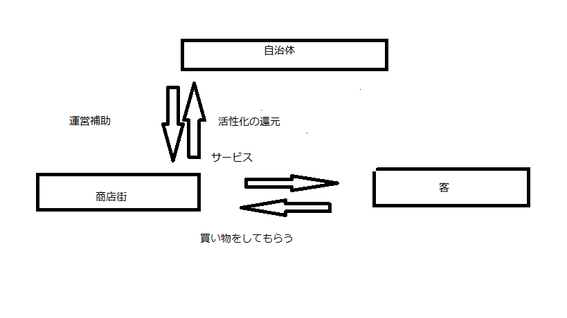

# ショッピングコインの仕組み
## 仕組みについて
ショッピングコインは自治体と顧客をつなぐという仕組みのコインです
 
### コインの取得方法
商店街への新規店を立ち上げたいという人が自治体に登録を行いポイントを付与される 一か月での顧客の数に応じたポイントが付与される
### 付与されたされたポイントの使い方
実際に出店する際にポイントを利用することによって店舗などの開始を行う 店舗のイノベーションの援助を行う 広告を打ち出す際の資金の援助などを行う
## リンク [テナントの違い](.
