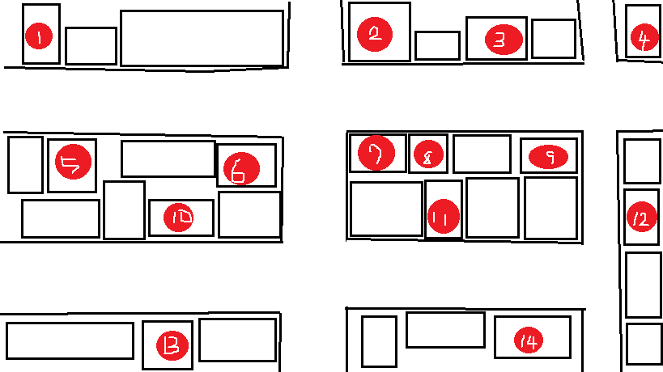

 # 空き店舗情報  
  
 1,○○ 
 2,△△ 
 3,□□ 
 4,×× 
 5,☆☆ 
 6,▽▽ 
 7,◇◇ 
 8,●● 
 9,★★ 
 10,▼▼ 
 11,◎◎ 
 12,▲▲ 
 13,◆◆ 
 14,＃＃ 

## リンク
[トップページ](https://u50116.github.io/ShoppingCoin/index)  
[コインの仕組み](https://u50116.github.io/ShoppingCoin/CoinSystem)  
[テナントとの違い](https://u0116.github.io/ShoppingCoin/tenannto)  
